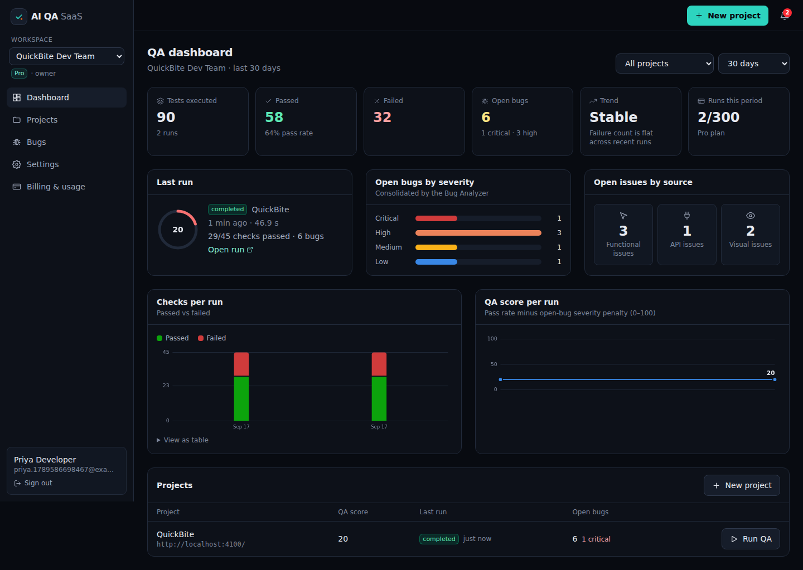
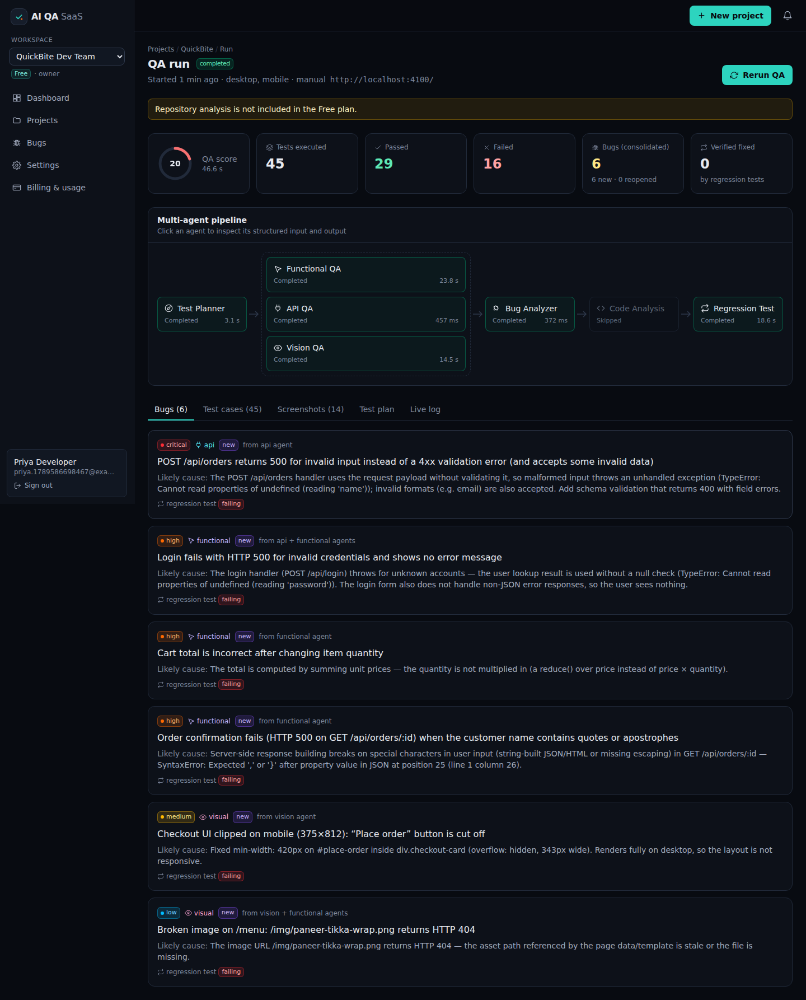
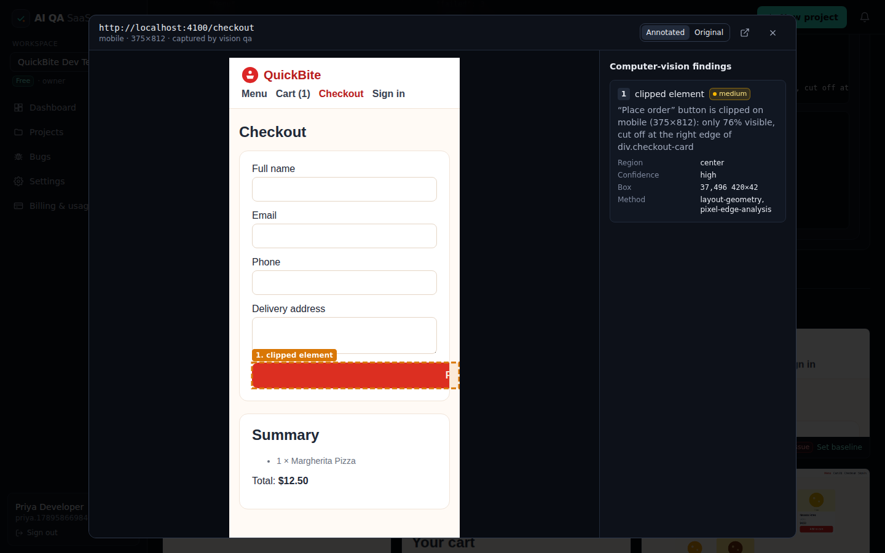
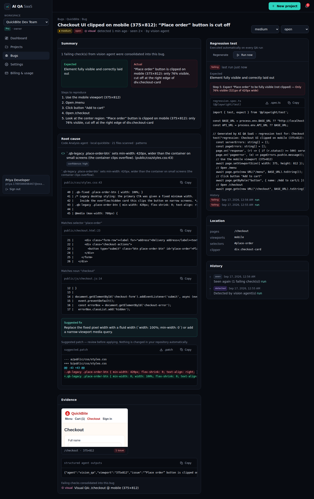

# AI QA SaaS

A developer QA platform delivered as SaaS, built for small businesses and small development teams.
A developer connects a web application (plus, optionally, a GitHub repository and an OpenAPI spec).
Seven specialised agents then plan and run functional, API and computer-vision tests, merge related
failures into developer-ready bugs, point to the likely source files, and generate regression tests.
Everything is stored per workspace: runs, evidence, bugs, history and usage.

```
USER / SMALL BUSINESS
  → Developer SaaS dashboard (React)
  → Project + URL + optional GitHub / OpenAPI
  → QA Orchestrator (in-process job queue)
  → Test Planner Agent
  → Functional Agent ∥ API Agent ∥ Vision (CV) Agent        ← run in parallel on the shared plan
  → Bug Analyzer
  → Code Analysis Agent → Regression Test Agent
  → MongoDB (bugs, runs, agentRuns, …) + evidence storage (disk / S3)
  → Developer dashboard & reports
```

## What's in the repo

| Folder | What it is |
|---|---|
| `server/` | Node.js + Express + TypeScript API, Mongoose models, JWT auth, plans/usage, and the QA engine (`src/qa`) |
| `web/` | React 19 + TypeScript + Tailwind CSS app with all the pages from the spec |
| `quickbite/` | **QuickBite**, the demo restaurant-ordering site with 6 intentional bugs and a "fixed" mode |

### The seven agents (`server/src/qa/agents`)

Each agent has its own input, output and `agentRuns` record. You can open any of them from the run page.

| Agent | Input → Output | How it works |
|---|---|---|
| 1. Test Planner | URL, spec, credentials → shared test plan | Crawls pages with Playwright and classifies them (login, catalog, cart, checkout…). Reads OpenAPI (it also checks common spec paths), scans JS bundles for `fetch` calls, and builds scenarios, API checks and visual targets |
| 2. Functional QA | scenarios → pass/fail + evidence | Runs real browser workflows through a declarative step DSL. Captures network, console errors, uncaught exceptions and failure screenshots. Checks cart math, feedback messages, confirmations and broken media |
| 3. API QA | endpoints → API failures + evidence | Uses Playwright `APIRequestContext` to run contract checks and edge cases: empty body, missing field, wrong type, invalid email, malformed JSON, unknown id or route, invalid credentials, and slow responses |
| 4. Vision QA | screenshots + viewport → visual defects + regions | Captures full pages at 1440×900, 768×1024 and 375×812. A layout-geometry pass finds candidates, then **pixel analysis** confirms them (see below). Also compares against reference mockups or baselines, and can call an optional vision model. Outputs an annotated image |
| 5. Bug Analyzer | all failures → consolidated bugs | Groups failures by endpoint, asset, visual element or workflow, so one issue seen by several agents becomes one bug. Sets severity and likely cause, removes duplicates across runs, reopens regressions, and hands bugs it could not reproduce to the Regression agent |
| 6. Code Analysis | bug + repository → likely cause + file:line + patch | Reads GitHub (REST API, token optional) or a local folder in dev. Ranks files by routes, selectors, text and assets. Detects defect patterns such as missing null checks, unvalidated bodies, JSON built from strings, quantity ignored in totals, fixed widths and missing assets, and suggests a **patch without ever editing code** |
| 7. Regression Test | bug → repeatable test | Builds declarative steps that the platform re-runs on every QA run, plus an exportable `@playwright/test` spec. Confirms each new test fails before the fix, then marks the bug **fixed** once the test passes |

**Computer vision details:**

- **Clip confirmation:** checks that the element's paint colour reaches the clip edge on the inside and stops on the outside.
- **Empty or broken media:** uses luminance variance and Sobel edge density.
- **Reference comparison:** uses `pixelmatch` with grid-based clustering of the changed areas.
- **Annotations:** drawn with `sharp`, as numbered boxes with severity colours.

**AI model (optional):** set `ANTHROPIC_API_KEY` to add model-assisted planning notes, screenshot review, bug write-ups and patch suggestions. Without a key, every agent runs its deterministic engine, and all tests below run that way. Keys stay on the server.

### SaaS features

- **Accounts:** sign up, log in and log out, with JWT in an httpOnly cookie (Bearer tokens are also accepted for API use).
- **Workspaces:** each has members with roles (owner, admin, developer, viewer). A role check runs on every project, run and bug endpoint, and other tenants get a 404.
- **Projects:** each project's settings include GitHub and API configuration, a test account, default agents and viewports, and visual references or baselines.
- **Runs:** stored as `testRuns`, `testCases`, `agentRuns` and `screenshots`, with a live progress log and cancel support.
- **Bug tracker:** open, fixed and ignored statuses, plus severity, evidence and history.
- **Usage meter and plans:** Free, Pro and Team, with limits on projects, runs per month, members, viewports and repository analysis. Billing is in **test mode**, so there is no payment provider.
- **Notifications:** in-app alerts, plus email when `SMTP_URL` is set. They fire when a run finds critical bugs and when fixes are verified.
- **Security:**
  - GitHub tokens and test passwords are encrypted with AES-256-GCM and are write-only.
  - Real passwords never enter stored plans (steps use `{{secret:…}}` placeholders).
  - Evidence and logs are sanitised.
  - Rate limits apply to auth and run starts, and only one active run is allowed per project.
  - An SSRF guard (`ALLOW_PRIVATE_TARGETS=false` in production) blocks private targets.
  - Internal `/api/agents/*` endpoints need `INTERNAL_API_TOKEN`.
  - Helmet CSP is enabled.

### Pages

`/` landing · `/login` · `/dashboard` · `/projects` · `/projects/new` · `/projects/:id` · `/projects/:id/run` · `/runs/:id` · `/bugs` · `/bugs/:id` · `/fixes` · `/fixes/:id` · `/settings` · `/billing`

### API

| Endpoint | Purpose |
|---|---|
| `POST /api/auth/register` · `POST /api/auth/login` · `POST /api/auth/logout` · `GET /api/auth/me` | Auth |
| `POST /api/projects` · `GET /api/projects` · `GET/PATCH/DELETE /api/projects/:id` | Projects |
| `POST /api/projects/:id/runs` · `GET /api/projects/:id/runs` · `GET /api/runs/:id` · `POST /api/runs/:id/cancel` | QA runs |
| `GET /api/projects/:id/bugs` · `GET /api/bugs` · `GET/PATCH /api/bugs/:id` · `POST /api/bugs/:id/regression[?run=1]` | Bugs & regression tests |
| `GET /api/projects/:id/regression-tests` · `POST /api/projects/:id/references` · `POST /api/screenshots/:id/baseline` · `GET /api/screenshots/:id/image` | Tests & visual evidence |
| `GET /api/dashboard` · `GET /api/billing` · `POST /api/billing/plan` · `GET/PATCH /api/workspaces/current` · `…/members` · `GET /api/notifications` | SaaS |
| `GET /api/github/config` · `GET /api/github/oauth/start` · `GET /api/github/oauth/callback` · `GET /api/github/status` · `POST /api/github/token` · `DELETE /api/github/connection` | GitHub connection (OAuth or token) |
| `GET /api/github/repos?q=` · `GET /api/github/repos/:owner/:repo/branches` · `PUT/GET/DELETE /api/github/projects/:id/repository` | Repository & branch selection |
| `POST /api/autofixes` · `GET /api/autofixes` · `GET /api/autofixes/:id` · `POST /api/autofixes/:id/approve·reject·retry·cancel·refresh` | AI auto-fix → pull request |
| `POST /api/agents/plan` · `POST /api/agents/vision` · `GET /api/agents/queue` | Internal (server-side token only) |

MongoDB collections match the spec: `users, workspaces, members, projects, testRuns, testCases, bugs, agentRuns, screenshots, regressionTests`, plus `notifications`, `githubConnections` and `autoFixes`.

## Running it locally

Requirements: Node.js 20 or newer, MongoDB 6 or newer, `git` on the PATH (for AI auto-fix), and Chromium (installed by the setup script).

```bash
npm run setup                     # installs server, web, quickbite and Playwright Chromium
cp server/.env.example server/.env   # set MONGODB_URI, secrets; DEMO_REPO_PATH=<abs path to ./quickbite>
npm run build                     # builds the web app (served by the API)

# terminal 1 – demo target
npm run demo:app                  # QuickBite on http://localhost:4100 (buggy mode)
# terminal 2 – SaaS
npm start                         # http://localhost:4000
```

For frontend development, run `npm run dev:api` and `npm run dev:web` (Vite on :5173 proxies `/api`).

Docker alternative: `docker compose up --build`, then open http://localhost:4000. This starts MongoDB 7, the app and QuickBite.

### Demo script (about 3 minutes)

1. Sign up, then **Fill demo values** on *New project*, then **Create & start AI QA**.
2. Watch the live pipeline: Planner → Functional ∥ API ∥ Vision → Analyzer → Code → Regression.
3. Open the **Screenshots** tab. The annotated 375×812 checkout capture shows the clipped "Place order" button.
4. The **Bugs** tab shows 6 consolidated bugs from 16–18 raw failures (on the Free plan, repository analysis is skipped).
5. Go to **Billing** and switch to Pro (test mode), then **Rerun QA**. Bug pages now show file:line references, a suggested `.patch` and a downloadable Playwright spec.
6. "Fix" the app with `curl -X POST localhost:4100/__demo/mode -H 'content-type: application/json' -d '{"fixed":true}'` and rerun. The regression tests pass, all 6 bugs become **verified fixed**, the QA score reaches 100 and the trend shows *improving*.
7. Switch QuickBite back to buggy mode and rerun. The same bugs are **reopened** as regressions, with no duplicates.

QuickBite's intentional bugs:

| Workflow | Bug |
|---|---|
| Login | Unknown email crashes with an unhandled 500, and the UI shows nothing |
| Menu | Broken image |
| Cart | Total ignores quantity |
| Checkout API | Invalid payload returns 500, and an invalid email is accepted |
| Mobile checkout | "Place order" button clipped at 375px (and at 768px) |
| Order confirmation | Fails for names that contain `"` |

## GitHub auto-fix → pull request

The flow is: **GitHub login → select repository → select branch → detect bug → AI generates fix → before/after diff → you approve → `ai-fix/*` branch → minimal patch → tests/lint/build → commit → push → pull request.**
Everything talks to the real GitHub REST API and real `git`. Nothing is simulated.

### 1. Connect GitHub (choose one)

**OAuth App (recommended).**

1. On github.com, go to *Settings → Developer settings → OAuth Apps → New OAuth App*.
2. Fill in the app:
   - Homepage URL: `http://localhost:4000`
   - Authorization callback URL: `http://localhost:4000/api/github/oauth/callback`
3. Put the client id and secret in `server/.env` (or in your shell environment for Docker):

   ```
   GITHUB_CLIENT_ID=Ov23li...
   GITHUB_CLIENT_SECRET=...
   GITHUB_OAUTH_CALLBACK_URL=http://localhost:4000/api/github/oauth/callback
   ```

4. Restart the API. The login page now shows **Continue with GitHub**, and *Settings → GitHub* shows **Connect with GitHub**.
   - "Continue with GitHub" signs you in, or creates your account, using your verified primary GitHub email.

**Fine-grained personal access token.** No OAuth App is needed.

1. On github.com, go to *Settings → Developer settings → Fine-grained tokens*.
2. Select the repositories you want to fix.
3. Grant **Contents: Read and write** and **Pull requests: Read and write**. Metadata read access is added automatically.
4. Paste the token into *Settings → GitHub*.

In both cases the token is encrypted (AES-256-GCM, `APP_ENCRYPTION_KEY`) in `githubConnections`. The API never returns it, and it never reaches the browser or the logs.

### 2. Use it

1. **Link a repository.** Go to *Settings → GitHub*, pick the project, the repository and the **base branch**, then click **Link repository**.
   - Code Analysis now reads that branch through the GitHub API.
2. **Find bugs.** Run AI QA. Repository analysis needs the Pro or Team plan; in test mode you can switch plans on *Billing*.
3. **Generate a fix.** Open a bug and click **Generate AI fix**.
   - The server clones the base branch into `AUTOFIX_WORK_DIR` and records the baseline checks.
   - The AI proposes minimal find/replace edits.
   - You see the exact **Before / After** diff (or the unified diff) with its sha256.
4. **Approve.** Tick *I reviewed this exact diff* and click **Approve**. The server then:
   - creates `ai-fix/<bug>-<id>` from the base commit;
   - applies exactly the approved patch (`git apply --check`, then a byte-for-byte comparison);
   - runs install (`--ignore-scripts`), lint, typecheck, test and build (whichever scripts exist), plus syntax checks on the changed files;
   - if the checks pass: commits only the patched files (authored by you), pushes the `ai-fix/*` branch, and opens a PR with a report of the changes and checks.
5. **If validation fails,** the failing output goes back to the AI. It proposes a new attempt, which you must approve again, up to `AUTOFIX_MAX_ATTEMPTS` (default 3). You can also **Reject & regenerate** with feedback.
6. **Track the PRs.** The dashboard's **GitHub & AI fixes** panel, the project page and *AI fixes* show the repository, branch, attempt, check results and PR state (open, merged or closed).

### Safety rules enforced on the server

- **Branches:**
  - Pushes go only to new `ai-fix/*` branches, using an explicit refspec and never `--force`.
  - The base branch, `main`, `master` and the repository's default branch are refused.
- **Approval:**
  - Nothing is committed or pushed without an approval tied to the attempt number and the diff's sha256.
  - A new attempt always needs a new approval.
- **Patch scope:**
  - Only existing files may be edited, and each edit must match exactly once.
  - Size limits apply.
  - `.git`, `.github/workflows`, `node_modules`, `.env*`, lockfiles, keys and binaries are never touched.
  - The commit contains only the approved paths.
- **Git process:**
  - Git runs with a scrubbed environment, with no hooks, credential helpers or signing prompts.
  - The token is passed per command as an HTTP header, never written into the remote URL or `.git/config`.
- **Pre-existing failures:** a check that already failed on the base branch doesn't block the PR unless the change makes it worse. The PR body lists those checks.
- **Isolation:** validation runs the repository's own scripts. In production, run the API in an isolated container or VM, or set `AUTOFIX_RUN_VALIDATION=false` to skip the checks (the PR then says so).
- **AI engine:** with `ANTHROPIC_API_KEY` set, fixes come from Claude. Without it, a rule-based engine built on the Code Analysis findings produces the patch.

### Testing the GitHub flow

- `npm run test:acceptance` includes `github-autofix.acceptance.test.ts`. It runs the whole OAuth → repo → QA → fix → approval → failed validation → retry → push → PR → merge flow. The GitHub side is a local GitHub-compatible server: real `git http-backend` over bare repositories, plus the REST endpoints used. The product code runs unchanged, pointed there through `GITHUB_API_URL`/`GITHUB_WEB_URL`.
- `npm run test:ui:github` is the same flow in a real browser.
- `npm run test:github-live` runs the flow against **real github.com** with your token and a throwaway repository that contains the `quickbite` folder:

  ```bash
  # macOS/Linux
  GITHUB_TOKEN=github_pat_... GITHUB_TEST_REPO=you/quickbite-ai-qa-test npm run test:github-live
  # Windows PowerShell
  $env:GITHUB_TOKEN="github_pat_..."; $env:GITHUB_TEST_REPO="you/quickbite-ai-qa-test"; npm run test:github-live
  ```

  The script prints each diff and asks for your approval (add `-- --yes` to auto-approve). It finishes by opening a real PR on your repository.

## Tests

```bash
npm test                  # unit tests: planner, analyzer, code analysis on QuickBite, CV primitives, security helpers
npm run test:acceptance   # full end-to-end acceptance test against QuickBite (needs MongoDB + Chromium, ~2 min)
npm run test:ui           # browser walkthrough of the SaaS UI (needs the API on :4000 and QuickBite on :4100)
npm run test:ui:github    # browser walkthrough of GitHub login → fix → approval → PR (needs MongoDB + Chromium)
npm run test:github-live  # the same flow against real github.com (see above)
```

The acceptance test (`server/test/acceptance/quickbite.acceptance.test.ts`) follows the spec's end-to-end demo:

- **Planning and agents:** the planner finds the Login, Menu, Cart and Checkout workflows, and all 7 agents complete with structured output.
- **Functional:** the cart-total bug is found.
- **API:** invalid checkout data returning 500 is found, with critical severity.
- **Vision:** the checkout button is clipped at 375×812, confirmed by pixels. Desktop is clean.
- **Consolidation and code analysis:** 6 consolidated bugs, and code references point to `cart.js`, `orders.js` and `styles.css`.
- **Regression:** the regression tests reproduce the bugs. After the fix, all 6 are verified fixed with a QA score of 100. A regression reopens bugs without creating duplicates.
- **SaaS checks:** tenant isolation, plan limits, write-only secrets, notifications and input validation.

## Configuration

See `server/.env.example`. The most important settings:

- **Secrets:** `JWT_SECRET` and `APP_ENCRYPTION_KEY` (required in production).
- **Targets:** `ALLOW_PRIVATE_TARGETS` should be false for multi-tenant hosting. `ALLOW_LOCAL_REPOS` is for dev only.
- **Concurrency:** `QA_CONCURRENCY` sets how many runs execute at once.
- **Storage:** `S3_*` switches evidence storage to any S3-compatible bucket.
- **Email:** `SMTP_URL` enables notification emails.
- **AI:** `ANTHROPIC_API_KEY` and `ANTHROPIC_MODEL` turn on the optional model.
- **GitHub:** `GITHUB_CLIENT_ID`/`GITHUB_CLIENT_SECRET`/`GITHUB_OAUTH_CALLBACK_URL` enable OAuth. `GITHUB_API_URL`/`GITHUB_WEB_URL` point to GitHub Enterprise. `AUTOFIX_*` controls the fix engine.

## Roadmap (from the spec)

GitHub PR comments, waiting for GitHub Actions results before marking a fix done, CI/CD-triggered runs, scheduled nightly runs, Slack notifications, a real payment provider, and a Redis/BullMQ queue for multi-instance deployments.

## Screenshots





